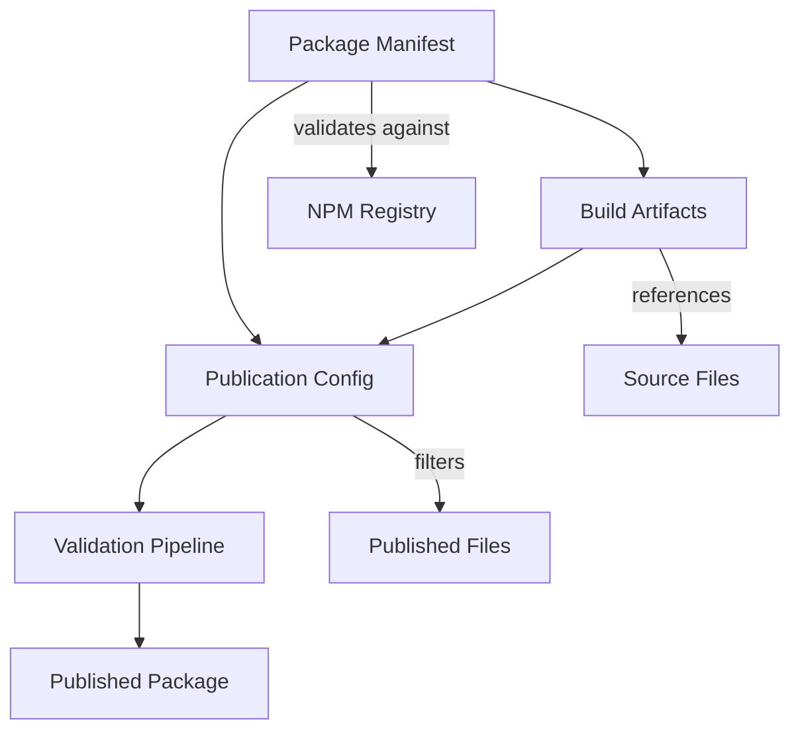

# Data Model: NPM Package Publication Preparation

## Overview

This document defines the data structures and entities involved in npm package publication preparation. The model focuses on configuration validation, build artifacts, and publication metadata required for successful npm publishing.

## Core Entities

### Package Manifest

**Purpose**: Represents the complete npm package configuration including metadata, dependencies, and publishing settings.

**Fields**:

- `name`: Package name (must be unique in npm registry)
- `version`: Semantic version (major.minor.patch)
- `description`: Human-readable package description
- `main`: Entry point for CommonJS consumers
- `module`: Entry point for ESM consumers
- `types`: TypeScript declaration files entry point
- `exports`: Modern export map for dual package support
- `files`: Array of files/patterns to include in published package
- `keywords`: Array of searchable terms for npm registry
- `author`: Package author information
- `license`: SPDX license identifier
- `repository`: Git repository information
- `homepage`: Package documentation URL
- `dependencies`: Runtime dependencies map
- `devDependencies`: Development-only dependencies map
- `peerDependencies`: Consumer-provided dependencies map
- `scripts`: npm script commands
- `engines`: Node.js version requirements

**Validation Rules**:

- name must be available in npm registry or match existing package owned by publisher
- version must follow semantic versioning format
- main, module, types paths must point to existing files
- exports configuration must be valid and consistent with main/module/types
- license must be valid SPDX identifier
- dependencies must specify valid version ranges

**State Transitions**:

- Draft → Validated (all required fields present and valid)
- Validated → Published (successfully uploaded to npm registry)

### Build Artifacts

**Purpose**: Represents the compiled output files that will be distributed to package consumers.

**Fields**:

- `sourceFiles`: Array of TypeScript source file paths
- `outputFiles`: Array of generated JavaScript file paths
- `declarationFiles`: Array of generated TypeScript declaration (.d.ts) file paths
- `sourcemapFiles`: Array of generated sourcemap file paths
- `buildConfig`: Build tool configuration (tsconfig.json, tsup.config.ts)
- `buildMetadata`: Build timestamp, version, target information
- `fileSizeMap`: Map of output file paths to file sizes in bytes
- `compressionStats`: Gzip/Brotli compression statistics

**Validation Rules**:

- All outputFiles must exist and be valid JavaScript
- All declarationFiles must exist and be valid TypeScript declarations
- File sizes must meet optimization targets (<50KB total)
- All sourceFiles must have corresponding outputs
- Build metadata must include required version information

**State Transitions**:

- Source Changed → Stale (source files modified since last build)
- Stale → Building (build process initiated)
- Building → Built (successful compilation)
- Building → Failed (compilation errors)

### Publication Config

**Purpose**: Represents file inclusion/exclusion patterns, export mappings, and npm publishing settings.

**Fields**:

- `includedFiles`: Array of file patterns to include in published package
- `excludedFiles`: Array of file patterns to exclude from published package
- `exportMappings`: Map of export paths to file system paths
- `publishConfig`: npm publish configuration (registry, access level, etc.)
- `provenance`: Package provenance/signing configuration
- `validationRules`: Array of validation checks to perform before publishing
- `testConfig`: Local testing configuration (npm pack, yalc settings)

**Validation Rules**:

- includedFiles patterns must match existing files
- excludedFiles must not overlap with includedFiles for same paths
- exportMappings must reference valid build artifacts
- publishConfig registry must be accessible
- All validationRules must have corresponding validation implementations

**Relationships**:

- References Build Artifacts through exportMappings
- Validates Package Manifest through validationRules
- Generates final publishable package structure

## Entity Relationships

### Package Manifest → Build Artifacts

- Package Manifest provides build configuration through scripts and exports
- Build Artifacts must align with Package Manifest entry points
- Version information flows from manifest to build metadata

### Build Artifacts → Publication Config

- Publication Config export mappings reference Build Artifacts output files
- File inclusion patterns must include all required Build Artifacts
- Build artifact validation informs Publication Config validation rules

### Publication Config → Validation Pipeline

- Validation rules in Publication Config drive validation execution
- File patterns determine which artifacts are validated
- Test configuration enables pre-publish verification

## Validation Constraints

### Cross-Entity Consistency

- Package Manifest main/module/types must reference existing Build Artifacts
- Publication Config export mappings must be consistent with Package Manifest exports
- Build Artifacts must include all files referenced by Publication Config

### Size and Performance Constraints

- Total Build Artifacts size must be under 50KB
- Build process must complete in under 30 seconds
- Individual file sizes must be optimized for network transfer

### Quality Gates

- All Build Artifacts must pass TypeScript compilation
- Package Manifest must pass npm package validation
- Publication Config must pass file inclusion validation
- Final package must pass local installation testing

## Error Handling

### Validation Errors

- Missing required Package Manifest fields → ValidationError with specific field names
- Invalid Build Artifacts (compilation failures) → BuildError with compiler output
- Inconsistent Publication Config → ConfigurationError with conflict details

### Runtime Errors

- npm registry unavailable → RegistryError with retry strategy
- File system errors during build → FileSystemError with affected paths
- Network timeouts during validation → NetworkError with fallback options

This data model supports the full npm publishing workflow while maintaining type safety and comprehensive validation throughout the process.
