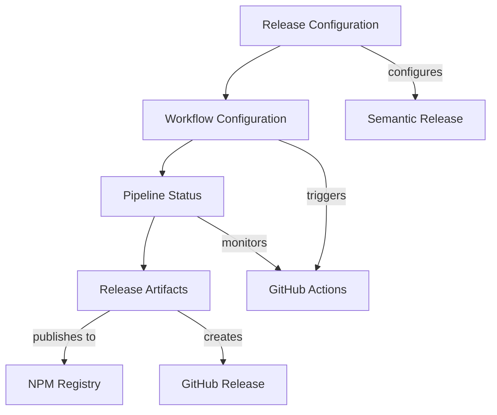

# Data Model: NPM Package Publication Automation Pipeline

## Overview

This document defines the data structures and entities involved in automated npm package publication pipeline. The model focuses on CI/CD workflow configuration, semantic versioning automation, and GitHub Actions pipeline management required for hands-off publishing.

## Core Entities

### Release Configuration

**Purpose**: Represents the semantic-release configuration that controls automated versioning and publishing behavior.

**Fields**:

- `branches`: Array of branch configurations for release triggers
- `plugins`: Ordered array of semantic-release plugins and their configuration
- `repositoryUrl`: Git repository URL for release context
- `tagFormat`: Template for git tag naming (e.g., "v${version}")
- `dryRun`: Boolean flag for testing without actual publishing
- `debug`: Boolean flag for verbose logging output

**Validation Rules**:

- branches array must include at least one branch configuration
- plugins array must include commit-analyzer and release-notes-generator
- repositoryUrl must match actual git remote URL
- tagFormat must be valid template string

**State Transitions**:

- Draft → Validated (configuration syntax valid)
- Validated → Active (used by semantic-release)

### Workflow Configuration

**Purpose**: Represents GitHub Actions workflow definition for CI/CD pipeline execution.

**Fields**:

- `name`: Human-readable workflow name
- `triggers`: Event triggers (push, pull_request, workflow_dispatch)
- `jobs`: Map of job definitions with dependencies
- `environment`: Runtime environment configuration (Node.js version, OS)
- `secrets`: Required secrets for authentication (NPM_TOKEN, GITHUB_TOKEN)
- `permissions`: GitHub token permissions for repository actions

**Validation Rules**:

- triggers must include at least push events for main branch
- jobs must include validation and release jobs
- environment must specify supported Node.js versions (>=18)
- secrets must include NPM_TOKEN for package publishing
- permissions must allow content:write for releases

**Relationships**:

- References Release Configuration through semantic-release step
- Validates against Package Manifest for build/test commands
- Generates Release Artifacts upon successful execution

### Release Artifacts

**Purpose**: Represents the outputs generated during successful release execution.

**Fields**:

- `version`: Semantic version string generated by semantic-release
- `gitTag`: Git tag created for the release
- `releaseNotes`: Markdown-formatted changelog content
- `npmPackageUrl`: URL to published package on npm registry
- `githubReleaseUrl`: URL to GitHub release page
- `buildArtifacts`: Array of file paths included in release
- `publishTimestamp`: ISO timestamp of successful publication
- `commitSha`: Git commit SHA that triggered the release

**Validation Rules**:

- version must follow semantic versioning format (major.minor.patch)
- gitTag must match configured tagFormat template
- npmPackageUrl must be valid npm registry URL
- githubReleaseUrl must be valid GitHub release URL
- buildArtifacts must exist and match package files configuration

**State Transitions**:

- Pending → Building (CI/CD pipeline started)
- Building → Ready (validation passed, artifacts built)
- Ready → Published (npm package published successfully)
- Published → Released (GitHub release created)

### Pipeline Status

**Purpose**: Represents the current state and execution context of the CI/CD pipeline.

**Fields**:

- `workflowRunId`: GitHub Actions workflow run identifier
- `triggerCommit`: Git commit that initiated the pipeline
- `pipelineStage`: Current stage of execution (setup, validate, build, release, publish)
- `jobStatuses`: Map of job names to their execution status
- `startTime`: Pipeline execution start timestamp
- `endTime`: Pipeline completion timestamp (if finished)
- `errorLogs`: Array of error messages if failures occurred
- `artifactUrls`: Map of generated artifact names to download URLs

**Validation Rules**:

- workflowRunId must be valid GitHub Actions run ID
- triggerCommit must be valid git commit SHA
- pipelineStage must be valid stage enum value
- jobStatuses must include all defined workflow jobs
- startTime must be valid ISO timestamp

**Relationships**:

- References Release Artifacts upon successful completion
- Links to Workflow Configuration that defined the execution
- Connects to external GitHub Actions run for detailed logs

## Entity Relationships

### Release Configuration → Workflow Configuration

- Release Configuration defines semantic-release behavior called by workflow
- Workflow Configuration references release config in semantic-release job step
- Version numbering strategy flows from release config to workflow triggers

### Workflow Configuration → Pipeline Status

- Workflow Configuration defines job structure monitored by Pipeline Status
- Pipeline Status tracks execution of jobs defined in Workflow Configuration
- Error handling strategies defined in workflow are reflected in status tracking

### Pipeline Status → Release Artifacts

- Pipeline Status coordinates creation of Release Artifacts
- Release Artifacts are only generated upon successful Pipeline Status completion
- Artifact URLs and metadata flow from pipeline execution to artifact records

## Configuration Constraints

### Cross-Entity Consistency

- Release Configuration branch settings must match Workflow Configuration triggers
- Workflow Configuration job definitions must align with Pipeline Status tracking
- Release Artifacts must include all files specified in Package Manifest

### Performance and Reliability Constraints

- Total pipeline execution must complete within 5 minutes
- Individual jobs must include timeout settings to prevent hanging
- Retry logic must be configured for transient npm registry failures

### Security Requirements

- All secrets must be properly configured in GitHub repository settings
- npm authentication must use time-limited tokens or OIDC
- Package provenance must be enabled for supply chain transparency

## Error Handling

### Configuration Errors

- Invalid Release Configuration → ConfigurationError with specific validation failures
- Missing Workflow Configuration secrets → AuthenticationError with setup instructions
- Malformed Pipeline Status → ExecutionError with job-specific error details

### Runtime Errors

- GitHub Actions execution failures → WorkflowError with link to failed run
- npm registry publishing failures → PublishError with retry instructions
- semantic-release errors → VersioningError with commit message requirements

### Recovery Strategies

- Failed releases can be retried by pushing new commits
- Version conflicts resolved through semantic-release's built-in logic
- Build failures addressed through clear error messaging and debugging info

This data model supports the complete automation pipeline while maintaining clear separation of concerns and comprehensive error handling throughout the release process.
